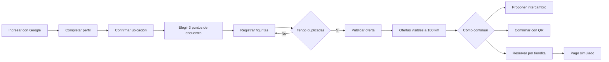
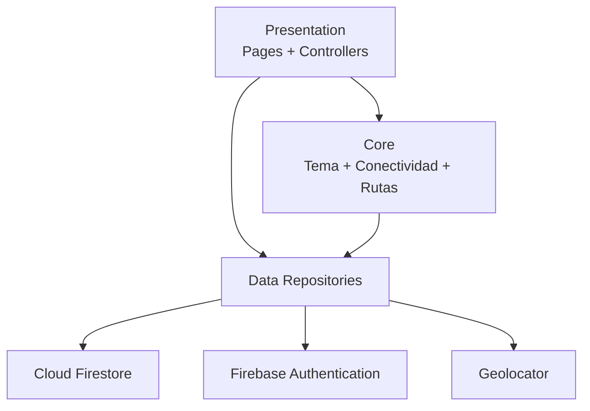
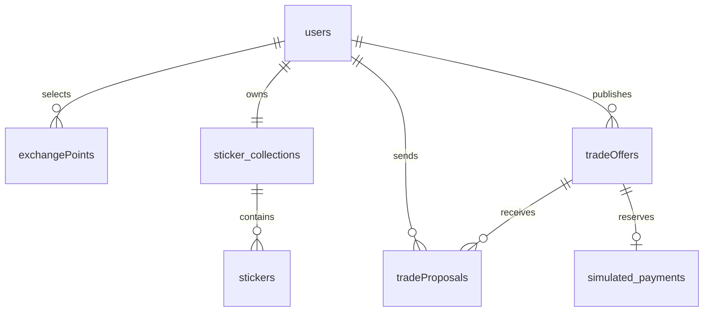

<div align="center">

# FIGUGOL

### Tu álbum futbolero para coleccionar, encontrar y cambiar figuritas

**Una app móvil Flutter para organizar stickers, descubrir ofertas cercanas y coordinar intercambios con confianza.**

<p>
  
  
  
  
</p>

<p>
  <strong>Colección</strong> &nbsp;|&nbsp;
  <strong>Intercambios a 100 km</strong> &nbsp;|&nbsp;
  <strong>QR presencial</strong> &nbsp;|&nbsp;
  <strong>Tiendita simulada</strong>
</p>

</div>

---

## Visión

**FIGUGOL** acompaña la emoción de armar una colección de figuritas de un torneo mundial: el usuario registra las que tiene, identifica sus repetidas, publica intercambios y encuentra coleccionistas dentro de su zona.

La experiencia está pensada para Android, con interfaz en español, ubicación aproximada para descubrimiento local y flujos claros para proponer, reservar o confirmar un intercambio.

> **Importante:** la tiendita representa una reserva con pago **simulado**. La aplicación no recopila tarjetas, credenciales financieras ni procesa cargos reales.

## Funciones Principales

| Módulo | Experiencia disponible |
| --- | --- |
| Acceso | Inicio de sesión con Google y perfil de coleccionista. |
| Mi colección | Registro de figuritas, repetidas y faltantes con filtros por selección. |
| Catálogo | Identificación por país, por ejemplo `MEX-01`, `URU-01` y piezas especiales como `URU-ESC`. |
| Ubicación | Confirmación de ubicación y selección de tres puntos de encuentro. |
| Ofertas | Publicación de duplicadas y exploración de intercambios en Huancayo dentro de un radio de `100 km`. |
| Propuestas | Elección de figuritas para ofrecer y solicitar con validación transaccional. |
| Intercambio QR | Generación y lectura de QR asociados a ofertas activas. |
| Tiendita | Reserva de una oferta mediante una operación simulada y protegida contra dobles reservas. |
| Conectividad | Comprobación de internet antes de operaciones importantes. |

## Flujo Del Coleccionista



## Estado Actual

| Area | Estado | Detalle |
| --- | --- | --- |
| Autenticación y perfil | Implementado | Firebase Authentication, Google Sign-In y perfil en Firestore. |
| Álbum y repetidas | Implementado | Catálogo base, cantidades personales y carrito de intercambio. |
| Ofertas cercanas | Implementado | Filtrado exacto por distancia hasta `100 km`. |
| Propuesta directa | Implementado | Creación con comprobación de oferta activa y duplicadas disponibles. |
| QR | Implementado | Generación y lectura de ofertas para intercambio presencial. |
| Tiendita | Implementado como simulación | Crea reserva y registro simulado; no existe cobro real. |
| Preparación de lanzamiento | Pendiente de validación | Requiere despliegue de reglas, pruebas en dispositivos y revisión operativa. |

## Identidad Visual

La interfaz utiliza Material 3 y una paleta inspirada en cancha, álbum y celebración:

| Token | Color | Uso |
| --- | --- | --- |
| `fieldGreen` | `#0A3D2D` | Encabezados y superficies principales. |
| `grassGreen` | `#126B3A` | Acciones, estados positivos y selección. |
| `gold` | `#FFC947` | Acentos y detalles de colección. |
| `ink` | `#10231B` | Texto de alto contraste. |
| `pitch` | `#F3F8F1` | Fondo general. |

## Tecnología

| Capa | Herramientas |
| --- | --- |
| Aplicación móvil | Flutter, Dart, Material 3 |
| Estado local | Provider |
| Autenticación | Firebase Authentication, Google Sign-In |
| Datos remotos | Cloud Firestore |
| Ubicación | Geolocator |
| QR | `qr_flutter`, `mobile_scanner` |
| Calidad | `flutter_lints`, `flutter_test`, `flutter analyze` |

No se agregan servicios de pagos reales en esta fase. El módulo de pagos está aislado para permitir una integración futura solo cuando exista un alcance aprobado y seguro.

## Arquitectura

El proyecto usa una organización por funciones. Las capas aparecen donde aportan valor real: modelos, repositorios, controladores y páginas.

```text
lib/
  app.dart
  main.dart
  firebase_options.dart
  core/
    constants/
    routes/
    services/
    theme/
    widgets/
  features/
    auth/
    location/
    marketplace/
    offers/
    payments/
    profile/
    qr_exchange/
    stickers/
```



### Responsabilidades Por Función

| Carpeta | Responsabilidad |
| --- | --- |
| `core/` | Tema global, conectividad, rutas y widgets comunes. |
| `features/auth/` | Sesión, Google Sign-In y perfil inicial. |
| `features/stickers/` | Catálogo, colección personal, faltantes y repetidas. |
| `features/location/` | Ubicación aproximada y puntos de intercambio. |
| `features/offers/` | Ofertas, carrito, detalle y propuestas. |
| `features/qr_exchange/` | QR para ofertas e intercambio presencial. |
| `features/marketplace/` | Pantallas de tiendita y reserva. |
| `features/payments/` | Modelo y persistencia de operaciones simuladas. |

## Modelo De Datos

Firestore mantiene los nombres de colecciones y campos en inglés. La interfaz muestra textos en español.



| Ruta | Uso |
| --- | --- |
| `users/{uid}` | Perfil, nombre de intercambio y ubicación confirmada. |
| `users/{uid}/exchangePoints/{pointId}` | Tres lugares elegidos para reunirse. |
| `sticker_collections/{uid}/stickers/{stickerId}` | Cantidad de cada figurita del usuario. |
| `tradeOffers/{offerId}` | Oferta pública activa, reservada, completada o cancelada. |
| `tradeProposals/{proposalId}` | Propuesta entre dos coleccionistas. |
| `simulated_payments/{paymentId}` | Reserva simulada de tiendita, sin información financiera real. |

### Reglas Funcionales Clave

- Una oferta solo publica figuritas duplicadas y requiere al menos `6` unidades.
- El usuario debe confirmar ubicación y seleccionar `3` puntos de encuentro antes de publicar.
- Las ofertas visibles se limitan a `100 km` desde la ubicación confirmada.
- Una propuesta valida nuevamente la disponibilidad antes de guardarse.
- Una reserva de tiendita cambia una oferta activa a reservada mediante transacción.
- Las acciones remotas relevantes verifican conexión antes de ejecutarse.

## Instalación Local

### Requisitos

- Flutter SDK compatible con Dart `^3.11.5`.
- Android Studio o un dispositivo Android configurado para depuración.
- Firebase CLI para desplegar reglas, cuando corresponda.
- Un proyecto Firebase configurado para la aplicación.

### Preparación

```bash
git clone <url-del-repositorio>
cd figugol
flutter pub get
flutter run
```

### Configuración De Firebase

El arranque inicializa Firebase desde `lib/firebase_options.dart`. Para usar otro proyecto Firebase:

```bash
flutterfire configure
```

En Android, verifica que la configuración correspondiente exista en:

```text
android/app/google-services.json
```

Para aplicar las reglas incluidas en el repositorio:

```bash
firebase deploy --only firestore:rules
```

Configura también el método de acceso con Google desde Firebase Authentication y las huellas Android necesarias para el entorno donde se instalará la app.

## Ejecutar Y Verificar

```bash
flutter analyze --no-pub
flutter test --no-pub
flutter run
```

Las pruebas actuales comprueban:

- Render inicial de la pantalla de acceso.
- Códigos consecutivos de figuritas por país.
- Radio máximo de ofertas visibles de `100 km`.

## Seguridad Y Privacidad

| Principio | Aplicación en FIGUGOL |
| --- | --- |
| Mínimo dato de ubicación | Solo se almacena lo necesario para ubicar ofertas y puntos de encuentro. |
| Acceso autenticado | Ofertas, propuestas y reservas requieren usuario identificado. |
| Propuestas privadas | Solo sus participantes pueden consultarlas según reglas de Firestore. |
| Sin pagos reales | La tiendita registra un resultado simulado, nunca datos financieros. |
| Validación transaccional | Las reservas y propuestas comprueban estado/disponibilidad al momento de guardar. |

## Convenciones Del Proyecto

- Código, clases, campos y colecciones: nombres en inglés.
- Interfaz y mensajes al usuario: español.
- Copy del producto: genérico y centrado en figuritas, colección e intercambio.
- Estructura: cambios por función, manteniendo `main.dart` solo para arranque.
- Datos de demostración: claramente aislados en fuentes de catálogo o puntos semilla.
- Calidad mínima por cambio relevante: ejecutar `flutter analyze` y corregir incidencias.

## Hoja De Ruta

| Etapa | Objetivo |
| --- | --- |
| 1 | Ampliar el catálogo y administrar contenidos desde una fuente mantenible. |
| 2 | Incorporar gestión completa de propuestas recibidas: aceptar, rechazar y completar. |
| 3 | Fortalecer confirmación de intercambio presencial y trazabilidad QR. |
| 4 | Agregar pruebas de repositorios, reglas y recorridos de usuario. |
| 5 | Preparar monitoreo, privacidad y checklist de lanzamiento Android. |
| 6 | Evaluar un proveedor de pagos solo en una fase futura con requerimientos formales. |

## Estructura De Contribución

Antes de desarrollar una mejora:

1. Identifica la función afectada.
2. Mantiene los cambios dentro de su carpeta y del soporte indispensable en `core/`.
3. Justifica cualquier dependencia nueva.
4. Conserva mensajes visibles en español.
5. Evita datos sensibles y cualquier flujo que pueda cobrar a una persona.
6. Ejecuta análisis y pruebas antes de entregar.

---

<div align="center">

### FIGUGOL

**Colecciona. Encuentra. Intercambia.**

Construido con Flutter para una comunidad de coleccionistas.

</div>
